# ⌨️ CorneKeyboar Rey – Configuración ZMK

Configuración personalizada del teclado **Corne (CRKBD) low-profile** usando **ZMK firmware**.  
Un proyecto para tener un teclado **inalámbrico, ergonómico y con RGB dinámico**.

---

## ✨ Características

- 🔋 **Bluetooth**: conexión inalámbrica estable
- 🌈 **RGB**: iluminación configurable por tecla y efectos dinámicos
- ⌨️ **Keymap personalizado**: capas optimizadas para productividad
- ⚡ **Perfil bajo**: escritura ligera y ergonómica
- 🛠️ **ZMK modular**: configuración fácil de mantener y modificar

---

## 🚀 Instalación y compilación

### 1. Clonar este repositorio

```bash
git clone https://github.com/hernandorey/cornekeyboar-rey.git
cd cornekeyboar-rey
```

### 2. Instalar dependencias de ZMK

Sigue la guía oficial 👉 [ZMK Docs – Setup](https://zmk.dev/docs/development/setup)

### 3. Compilar firmware para cada mitad

```bash
# Lado izquierdo
west build -s zmk/app -b corne_left -- -DSHIELD=corne_left

# Lado derecho
west build -s zmk/app -b corne_right -- -DSHIELD=corne_right
```

### 4. Flashear el teclado

Conecta cada mitad y flashea el archivo `.uf2` generado en la carpeta `build/`.

---

## 🎨 Personalización del keymap

- Los **layouts** están en la carpeta [`keymap/`](./keymap)
- Puedes modificar:
  - Capas (layers)
  - Combinaciones de teclas
  - Atajos especiales

📖 Documentación: [Guía de keymaps en ZMK](https://zmk.dev/docs/keymaps)

---

## 📸 Capturas

<div align="center">

  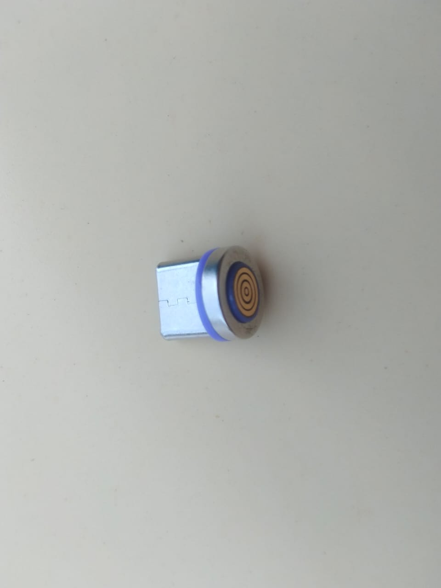
  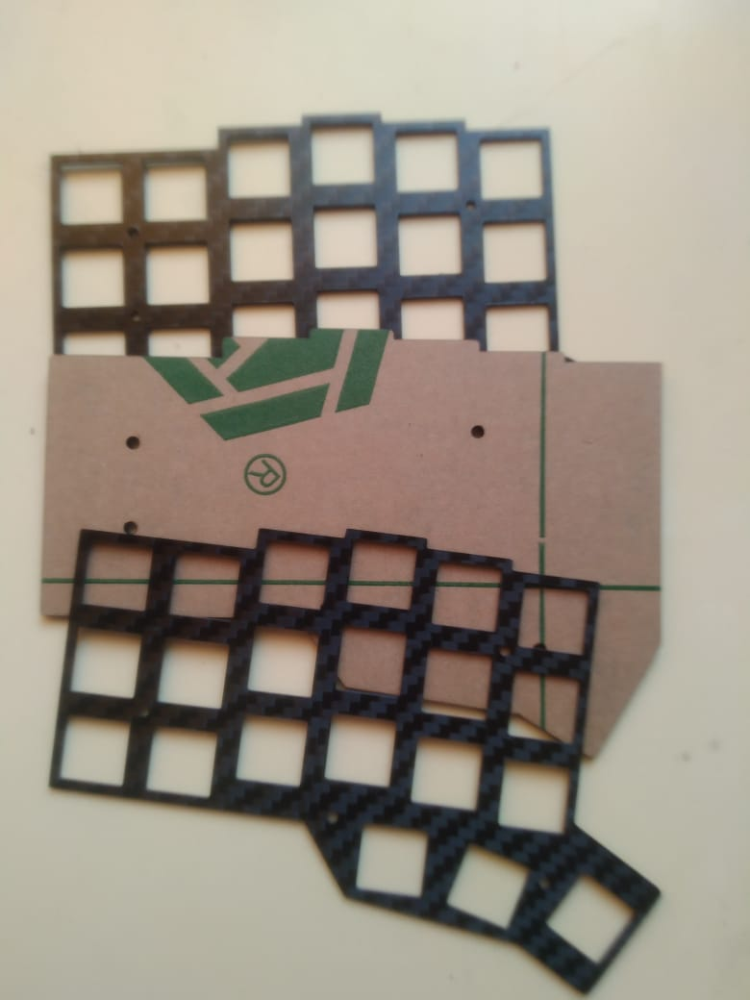

  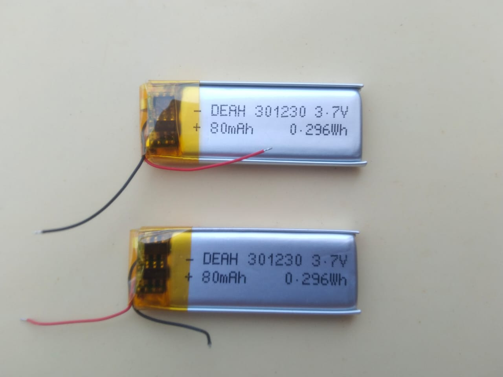
  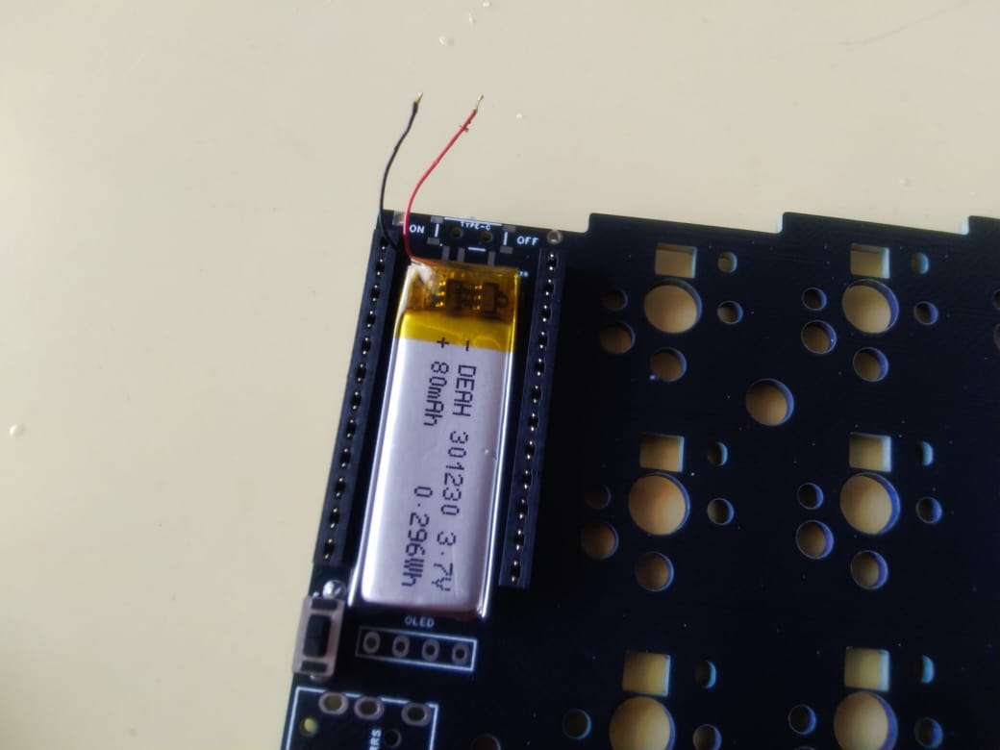

  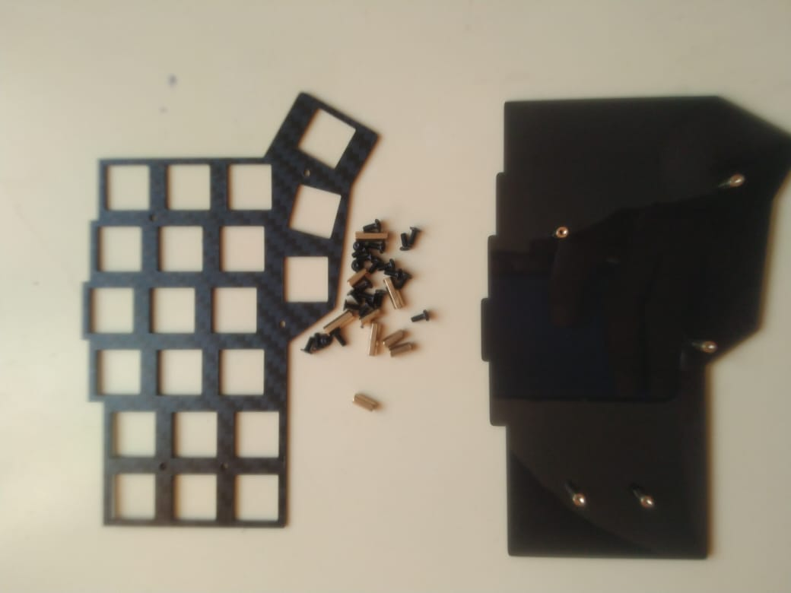
  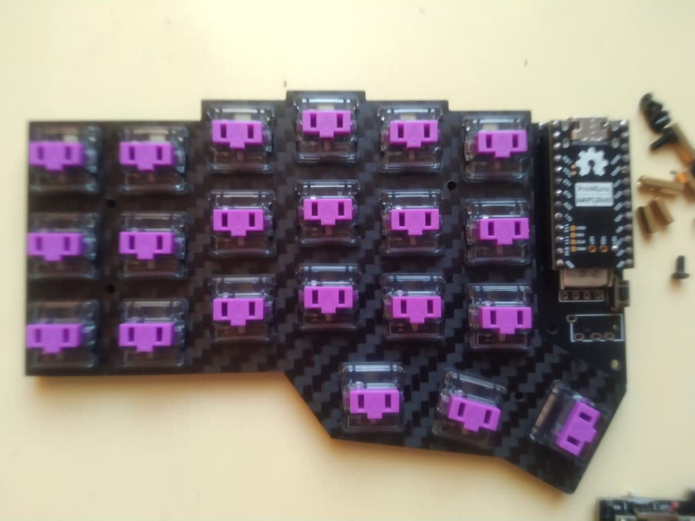

  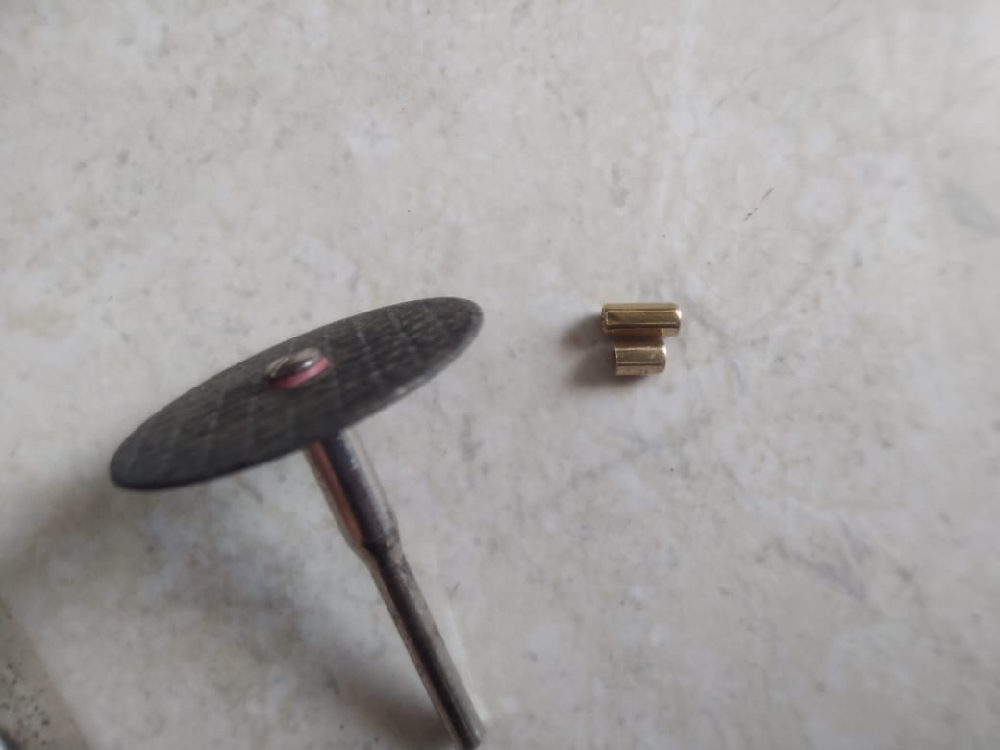
  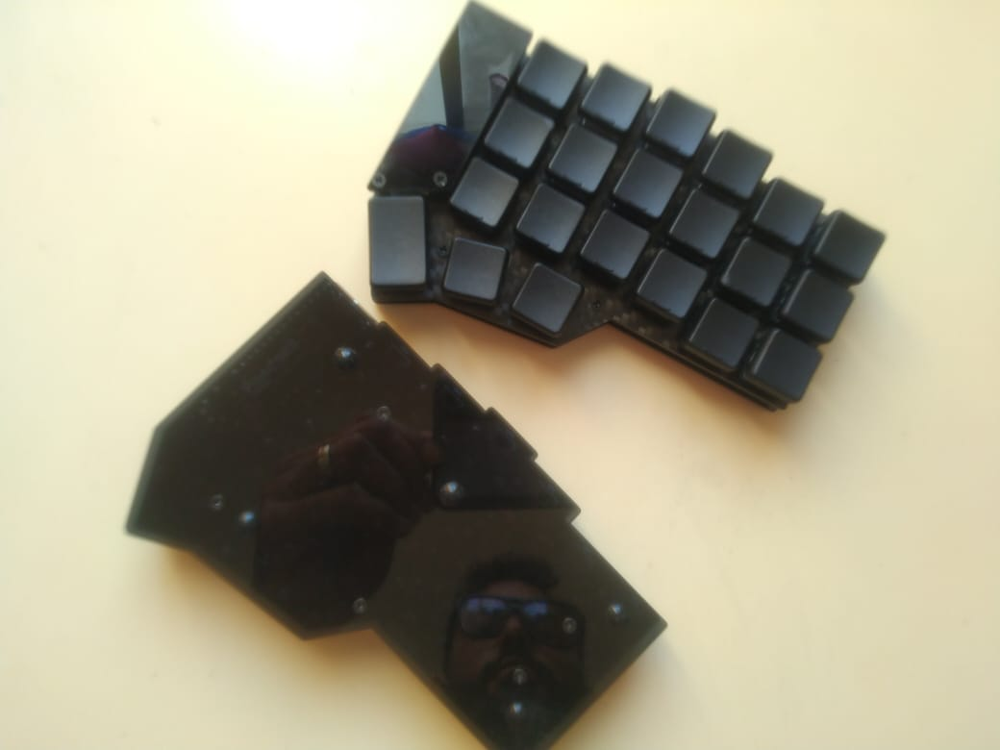

  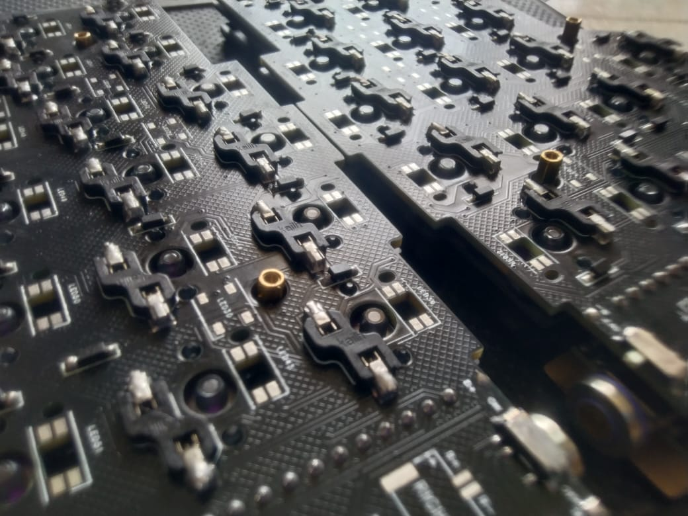
  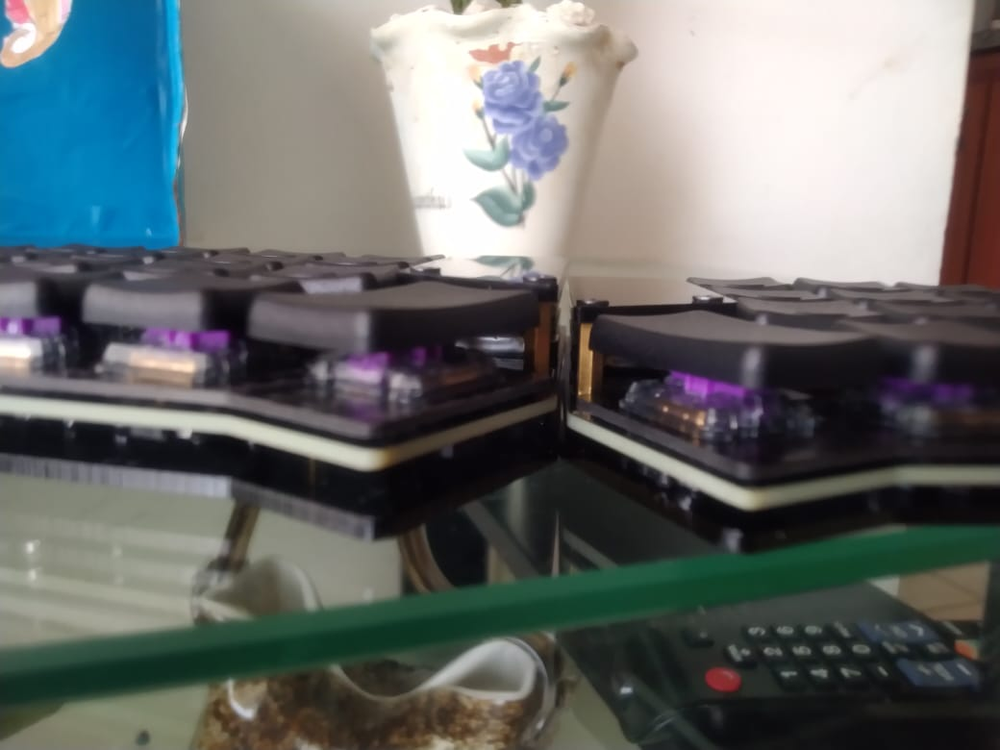

  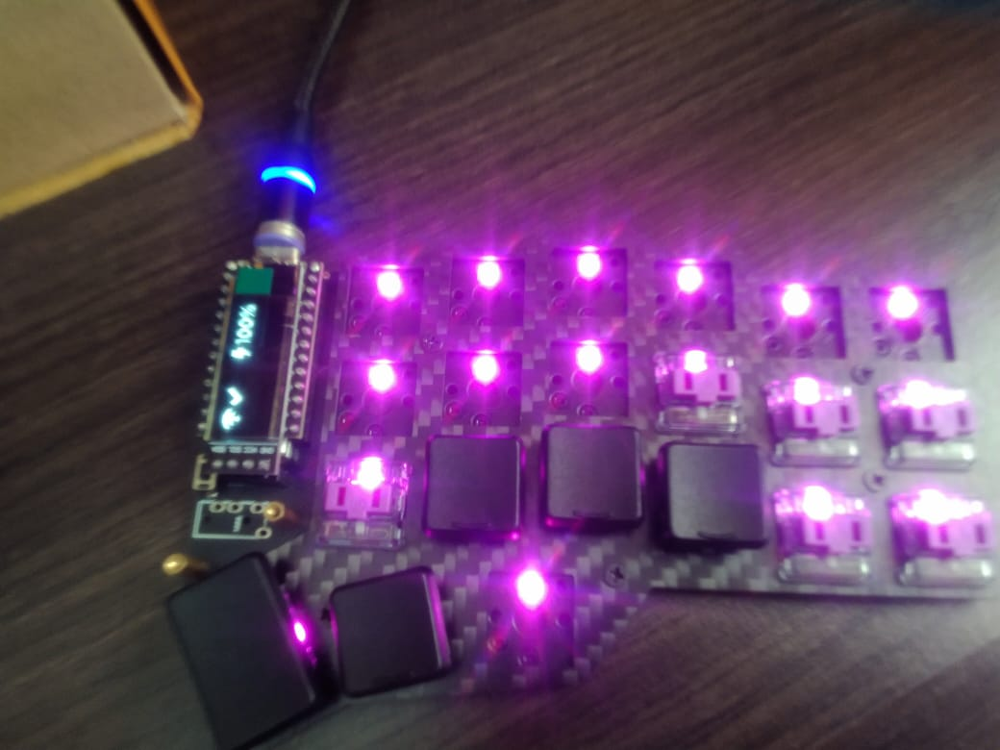
  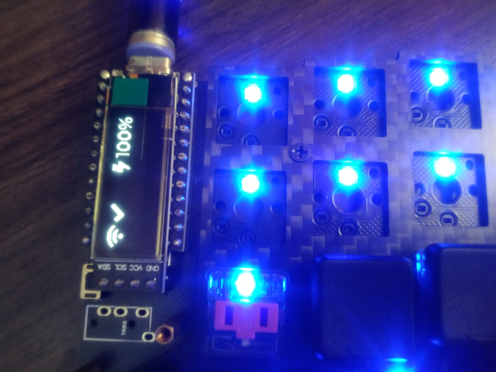

</div>

---

## 📚 Recursos útiles

- 📘 [ZMK Firmware Docs](https://zmk.dev/docs)
- ⌨️ [Corne Keyboard Info](https://github.com/foostan/crkbd)
- 💬 [ZMK Discord](https://zmk.dev/community/discord)

---

## 👤 Autor

Proyecto creado por **Hernando Rey**  
🔗 [GitHub](https://github.com/hrking31)

---

⭐ Si este proyecto te resulta útil, ¡no olvides dejar una estrella en el repo!
