# ⌨️ CorneKeyboard Rey – Configuración ZMK

Configuración personalizada de un teclado **Corne (CRKBD) low-profile** con **firmware ZMK**.
Inalámbrico, ergonómico, con RGB y pantalla OLED.

Distribución **Dvorak adaptada al español**, 6 capas, 33 macros y 41 combos, orientada a
programar en Visual Studio Code y a manejar ventanas con Komorebi sin tocar el mouse.

> 🔎 ¿Quieres ver el keymap de forma visual?
> **[Corne ZMK Visualizer Rey](https://hrking31.github.io/corne-keymap-visualizer-rey/)** —
> visualizador interactivo de las 6 capas, tecla por tecla.

---

## 🦴 Por qué un teclado dividido

Nadie se compra un teclado partido en dos porque le parezca bonito. Se lo compra porque algo
empezó a doler.

Jornadas largas frente a un teclado de 104 teclas, los hombros cerrados hacia adentro para
alcanzar el centro, la muñeca derecha girando cada dos minutos hacia el mouse, los meñiques
haciendo contorsiones para llegar a `Ctrl`, `Enter`, `Backspace` y las flechas.

El teclado tradicional arrastra un defecto de diseño desde las máquinas de escribir: las filas
están **escalonadas en diagonal** porque las palancas metálicas no podían chocar entre sí.
Nuestros dedos, en cambio, no se mueven en diagonal. Se mueven hacia adelante y hacia atrás.

Llevamos siglo y medio escribiendo sobre la solución a un problema que ya no existe.

El Corne corrige las tres cosas:

| Característica | Por qué importa |
|---|---|
| **Split** | Las dos mitades se separan al ancho de los hombros: se abren, y las muñecas quedan rectas |
| **Columnar stagger** | Las columnas se desplazan según el largo real de cada dedo, no en diagonal |
| **Thumb cluster** | 3 teclas bajo cada pulgar: el dedo más fuerte deja de servir solo para el espacio |

Y luego está el número: **42 teclas**. La primera reacción de todo el mundo es la misma:
*¿y dónde están los números? ¿y las F? ¿y la Ñ?*

No están. Hasta que tú decidas dónde ponerlas. Para eso son las capas.

---

## ✨ Características

- 🔋 **Bluetooth** con 5 perfiles guardados (PC, portátil, celular…)
- 🌈 **RGB direccionable**, 27 LEDs por mitad
- 📺 **Pantalla OLED** con capa activa, batería y pulsaciones por minuto
- ⌨️ **6 capas** pensadas para desarrollo
- ⚡ **33 macros** y **41 combos**
- 🪫 **Gestión de energía**: los LEDs solo encienden con el cable, y sueño profundo a los 15 min
- 🛠️ **Compilación automática** con GitHub Actions

---

## 🚀 Compilación

### Opción 1 — GitHub Actions (la que uso)

**No hace falta instalar nada.** Cada `push` a este repositorio compila el firmware
automáticamente:

1. Haz cambios en `config/` y súbelos.
2. Entra en la pestaña **[Actions](../../actions)** y espera a que termine el build.
3. Descarga el artefacto `firmware`, que contiene los dos `.uf2`.

### Opción 2 — Compilación local

Solo si quieres desarrollar sobre ZMK. Requiere el
[entorno de desarrollo de ZMK](https://zmk.dev/docs/development/setup):

```bash
west build -s zmk/app -b nice_nano_v2 -- -DSHIELD=corne_left
west build -s zmk/app -b nice_nano_v2 -- -DSHIELD=corne_right
```

> El **board** es `nice_nano_v2` (el microcontrolador) y el **shield** es
> `corne_left` / `corne_right` (la placa del teclado). Son cosas distintas.

### Flashear

Conecta una mitad por USB, toca **dos veces el botón de reset** para entrar en modo
bootloader, y arrastra el `.uf2` correspondiente a la unidad que aparece.

---

## 🗂️ Estructura

```
config/
  corne.keymap     # Las 6 capas
  corne.conf       # RGB, pantalla y gestión de energía
  macros.dtsi      # 33 macros (VS Code, Komorebi, Windows)
  combos.dtsi      # 41 combos
  west.yml         # Versión de ZMK
build.yaml         # Qué combinaciones compila GitHub Actions
```

---

## 🧠 Las 6 capas

Igual que `Shift` convierte `a` en `A`, una tecla de capa convierte **el teclado entero** en
otro teclado. Así caben 104 teclas en 42.

| Capa | Para qué sirve |
|------|----------------|
| **BASE** | Dvorak adaptado, con `Ñ` y tilde propias. Pulgares: `Shift`, `Espacio`, `Enter`, `Win` |
| **NUM** | Dígitos y atajos de VS Code: mover líneas, comentar, terminal, Git, explorador |
| **SYM** | Símbolos de programación conviviendo con `¡ ¿ °` del español |
| **NAV** | Navegación y control de ventanas con Komorebi |
| **LED** | Brillo, saturación, tono, velocidad y efecto del RGB |
| **FUN** | `F1`–`F12`, multimedia, perfiles Bluetooth y salida USB/BLE |

Cada capa se activa manteniendo una tecla de pulgar. BASE lleva a **NUM** y **SYM**;
desde NUM se llega a **NAV** y **FUN**; desde SYM, a **LED**.

### 🟢 La capa BASE: Dvorak adaptado al español

La idea de Dvorak es colocar las letras frecuentes en la fila de reposo: la mano izquierda
descansa sobre las vocales `A O E U I` y la derecha sobre `D H T N S`. Escribir deja de ser un
recorrido por todo el teclado y pasa a ser, la mayor parte del tiempo, movimiento local.

Sobre esa base hice **mis propios ajustes** —por eso digo «Dvorak adaptado» y no «Dvorak»—:

- La **`Ñ`** subió a la fila superior, al alcance del índice izquierdo. En español no es
  negociable, y Dvorak no la contempla.
- El **acento agudo `´`** tiene tecla propia en la fila inferior izquierda, para no pelear con
  las tildes.
- La `,` y el `.` viven en la fila superior, con `;` y `:` bajo `Shift`.
- Intercambié `H` y `R` respecto al Dvorak canónico, buscando el ritmo del español y no el del
  inglés, que es para el que Dvorak fue diseñado.

<details>
<summary><b>La parte honesta: aprender Dvorak</b></summary>

Cambiar a Dvorak y a un teclado de 42 teclas el mismo día es, básicamente, quedarse
analfabeto por decisión propia. Pasé de escribir sin mirar a buscar la `S` con la vista. Las
primeras semanas, responder un mensaje corto era un ejercicio de paciencia.

Hay un punto —el clásico *valle de la desesperación*— en el que sabes que el teclado nuevo es
mejor, pero eres notoriamente peor con él, y la tentación de volver atrás es real.

No hay atajo. Solo se sale escribiendo.

**Un consejo:** no cambies de distribución y de teclado el mismo día que entregas un proyecto.
Yo lo hice. No lo recomiendo.

</details>

---

## ⚡ Macros y combos

### Macros con plantilla

Un macro en ZMK ocupa doce líneas de devicetree. Con 33 macros eso sería inmantenible, así que
uso una plantilla con el preprocesador:

```c
#define MACRO(NAME, BINDINGS) \
  mcr_##NAME: mcr_##NAME { \
    label = EXPAND_AND_STRINGIFY(mcr_##NAME); \
    compatible = "zmk,behavior-macro"; \
    #binding-cells = <0>; \
    wait-ms = <20>; \
    tap-ms = <10>; \
    bindings = <BINDINGS>; \
  };
```

Y cada macro queda en una línea:

```c
MACRO(git,    &macro_press &kp LCTRL &macro_press &kp RSHFT &macro_tap &kp G ...)
MACRO(escrt1, &macro_press &kp LCTRL &macro_press &kp LALT  &macro_tap &kp N1 ...)
```

Esa `##` es concatenación de tokens del preprocesador: convierte `MACRO(git, …)` en un nodo
llamado `mcr_git`. Es el mismo truco que usarías para generar código repetitivo en cualquier
lenguaje, aplicado a un teclado.

### Combos sobre la letra física

Los combos disparan un atajo al pulsar dos teclas a la vez. El criterio: que el atajo caiga
**sobre su propia letra**.

```c
COMBO(copy,  <&kp LC(C)>, 24 8)    // Ctrl izquierdo + la tecla física C
COMBO(paste, <&kp LC(V)>, 24 33)   // Ctrl izquierdo + la tecla física V
COMBO(cut,   <&kp LC(X)>, 24 29)   // Ctrl izquierdo + la tecla física X
```

En Dvorak esas letras están en sitios rarísimos, así que un `Ctrl+C` normal exige una
contorsión. Con el combo, la memoria muscular de QWERTY sobrevive intacta: sigue siendo
«Control y la C», y la mano no tiene que aprender coordenadas nuevas.

---

## 🌈 Los LEDs no encienden: hay que declarar cuántos son

Terminé de soldar los LEDs, energicé el teclado… y nada. Ni una luz. Pasé horas leyendo
documentación y foros buscando qué había hecho mal con el soldador.

No era el soldador. Faltaba **una línea de configuración**:

```c
&led_strip {
    chain-length = <27>;
};
```

### Por qué

Los WS2812 no son LEDs sueltos: van **encadenados**, y cada uno lleva dentro un chip que
recibe los datos, se queda con su color y pasa el resto al siguiente. El firmware necesita
saber **cuántos hay** para armar el paquete de datos del tamaño correcto.

ZMK no lo adivina. Trae un valor por defecto en el overlay del board
(`app/boards/shields/corne/boards/nice_nano_v2.overlay`) y el comentario en el código fuente
es explícito:

```c
chain-length = <10>; /* arbitrary; change at will */
```

**Diez. Arbitrario. «Cámbialo a voluntad».** Es un número de relleno.

Mi Corne tiene **27 LEDs por mitad** (21 bajo las teclas y 6 en la parte trasera). Hasta que
no lo declaré, el firmware estaba hablándole a una cadena que no existía.

> 💡 Si acabas de soldar tus LEDs y no encienden, **cuenta cuántos tienes y decláralos** antes
> de desoldar nada. El dato no está en la guía de montaje ni en la plantilla de configuración:
> está en un archivo del repositorio de ZMK que nadie abre.

---

## 🔋 Gestión de energía

Los LEDs direccionables **consumen corriente aunque estén apagados**. Cada uno lleva un chip
que sigue despierto escuchando órdenes aunque no emita luz: alrededor de **1 mA por LED**, o
sea unos **27 mA por mitad**, permanentes y sin dar un fotón. Para comparar, el teclado entero
en reposo consume menos de 1 mA.

La documentación de ZMK lo reconoce: *«algunos LEDs consumirán energía incluso estando
apagados»*. Apagar la luz no es apagar el LED; hay que cortarle la corriente.

Con una batería pequeña eso vacía la carga en pocas horas, así que la configuración actual ata
el RGB al cable:

| Situación | LEDs | Pantalla | Consumo |
|---|---|---|---|
| **Con USB** | Encendidos | Encendida | Da igual, hay cable |
| **Con batería** | Apagados y **sin corriente** | Apagada | Mínimo |
| **15 min inactivo** | Apagados | Apagada | Sueño profundo |

Configuración responsable de esto, en `corne.conf`:

```
CONFIG_ZMK_RGB_UNDERGLOW_AUTO_OFF_USB=y   # LEDs atados al cable USB
CONFIG_ZMK_RGB_UNDERGLOW_ON_START=n       # manda el USB, no un valor fijo
CONFIG_ZMK_SLEEP=y                        # sueño profundo
CONFIG_ZMK_IDLE_SLEEP_TIMEOUT=900000      # a los 15 minutos
```

### ⚠️ El cable cambia a dónde escribes

ZMK envía las pulsaciones por USB en cuanto detecta el cable. Si lo enchufas solo para tener
luz —a un cargador o a otro equipo— dejarías de escribir en el dispositivo Bluetooth. Para eso
está `&out OUT_TOG` en la capa **FUN**: alterna la salida entre USB y Bluetooth, y la elección
se guarda en memoria flash.

---

## 🐛 La pantalla que encendía cuando le daba la gana

La pantalla OLED llevaba semanas comportándose de forma aparentemente aleatoria: **a veces
encendía y a veces no**. Sin patrón. Sin error visible. Lo había asumido como «cosas del
hardware barato».

<details>
<summary><b>Cómo lo encontré (spoiler: no era aleatorio)</b></summary>

### Las tres pistas

1. El teclado arrancaba con los LEDs apagados, aunque la configuración decía lo contrario.
2. La pantalla no respondía a nada de lo que hiciera **después** de encender el teclado.
3. Si reiniciaba con los LEDs **encendidos**, la pantalla funcionaba.

La tercera era la clave, pero solo después de entender las otras dos.

### Bajar al código

La documentación no lo explicaba, así que fui al código fuente de ZMK. Tres hallazgos, en tres
archivos distintos.

**Uno.** En `ext_power_generic.c`, con este comentario textual de los desarrolladores:

```c
// Enable by default. We may get disabled again once settings load.
ext_power_enable(dev);
```

Al arrancar, la energía externa **siempre** se enciende. Y luego, cuando cargan los ajustes
guardados en memoria flash, **puede volver a apagarse**.

**Dos.** En `rgb_underglow.c`, la función que restaura el estado guardado sobrescribe el valor
de configuración inicial. Por eso el teclado arrancaba con los LEDs apagados: no obedecía a mi
configuración, sino a lo último que yo había dejado antes de apagarlo.

**Tres.** En `display/main.c`, el remate:

```c
void initialize_display(struct k_work *work) {
    if (!device_is_ready(display)) {
        LOG_ERR("Failed to find display device");
        return;              // ← se rinde, y no lo vuelve a intentar
    }
    initialized = true;
```

**La pantalla se inicializa una sola vez, al arrancar. Si en ese instante exacto no tiene
corriente, el firmware se rinde y no reintenta jamás.**

### La causa

Los tres hallazgos juntos cuentan una historia coherente:

1. El teclado arranca y enciende la energía externa.
2. Cargan los ajustes: si dejé los LEDs apagados, **la energía se corta**.
3. La pantalla intenta inicializarse, no encuentra corriente y se rinde para siempre.

No era aleatorio. **Dependía enteramente del estado en que había dejado los LEDs la última vez
que apagué el teclado.** Una carrera entre tres subsistemas que no se conocen entre sí.

Y el motivo de que estuvieran acoplados: en la placa, los LEDs y la pantalla cuelgan del
**mismo cable de alimentación**, y el firmware solo tiene un interruptor para los dos.

### La decisión

Entendido el problema, resultó que no tenía solución técnica: era una elección.

- Con la energía cortada: los LEDs no consumen, pero no hay pantalla.
- Con la energía puesta: hay pantalla, pero los LEDs gastan 27 mA sin dar luz.

No hay configuración que gane en ambas. Es una limitación física de compartir el mismo raíl.

Lo resolví atando los LEDs al cable USB: **con cable, luces y pantalla; con batería, nada de
nada y máxima autonomía**. Más un sueño profundo a los quince minutos. El caso de uso decidió
lo que la técnica no podía.

</details>

---

## 💡 Lo que me llevo

**La configuración es código.** ZMK me obligó a tratar mi propio teclado como un proyecto de
software: versionado, revisable, reproducible, compilado por CI. Un mal día de configuración
deja de ser un problema y pasa a ser un commit que se descarta.

**La fricción bien invertida se paga sola.** Semanas escribiendo despacio a cambio de años
escribiendo mejor. Es el mismo cálculo que hacemos al escribir pruebas o al refactorizar algo
que «ya funciona».

**«Es aleatorio» casi nunca significa aleatorio.** Significa que aún no encontraste la
variable. La diferencia entre «raro» y «reproducible» fueron tres archivos de código fuente y
la disposición a leerlos en lugar de suponer.

**Cuando la documentación no responde, el código sí.** Ninguna página explicaba mis problemas.
Los dos comentarios que los resolvieron —`arbitrary; change at will` y `we may get disabled
again once settings load`— llevaban años escritos en el repositorio, esperando a que alguien
los leyera. Es open source: la respuesta está ahí.

**Los valores por defecto son decisiones que alguien tomó por ti.** A veces son sensatas y a
veces son un relleno provisional que se quedó. Diez LEDs porque había que poner un número.
El corte de energía atado al RGB, activado sin que yo lo pidiera. Ninguno de los dos aparecía
en mi configuración, y los dos determinaban cómo se comportaba mi teclado. Lo que no declaras
también es configuración.

**No todo problema tiene solución técnica.** A veces dos cosas que quieres son físicamente
incompatibles, y el trabajo de ingeniería no es encontrar el truco que las concilie, sino
entender el conflicto lo bastante bien como para elegir con criterio y saber exactamente qué
estás perdiendo.

---

## 📸 Capturas

<div align="center">

  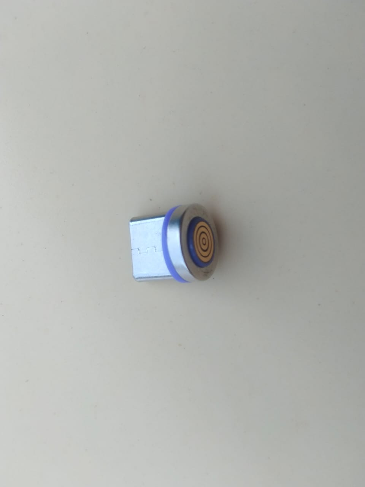
  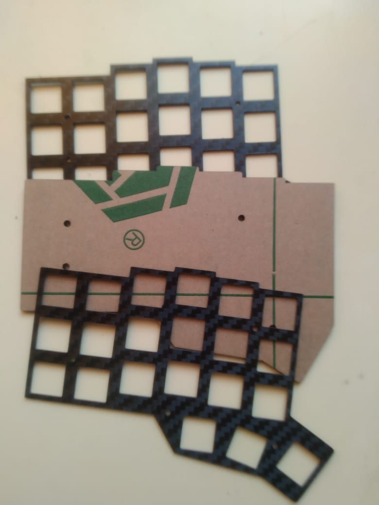

  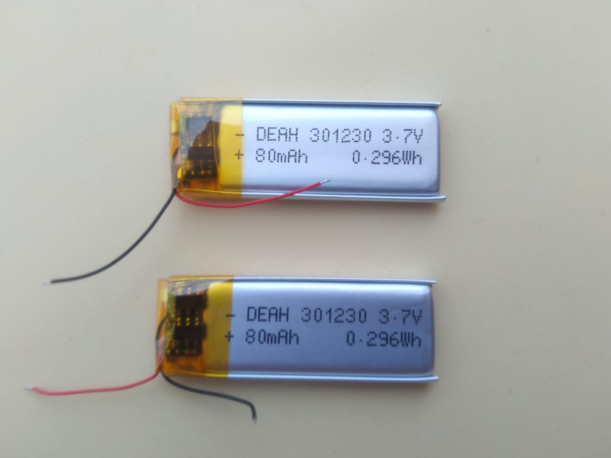
  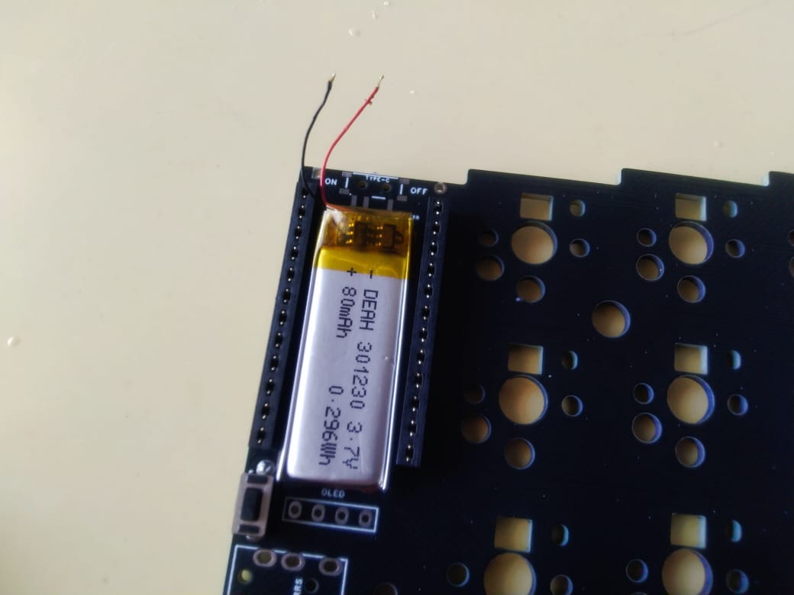

  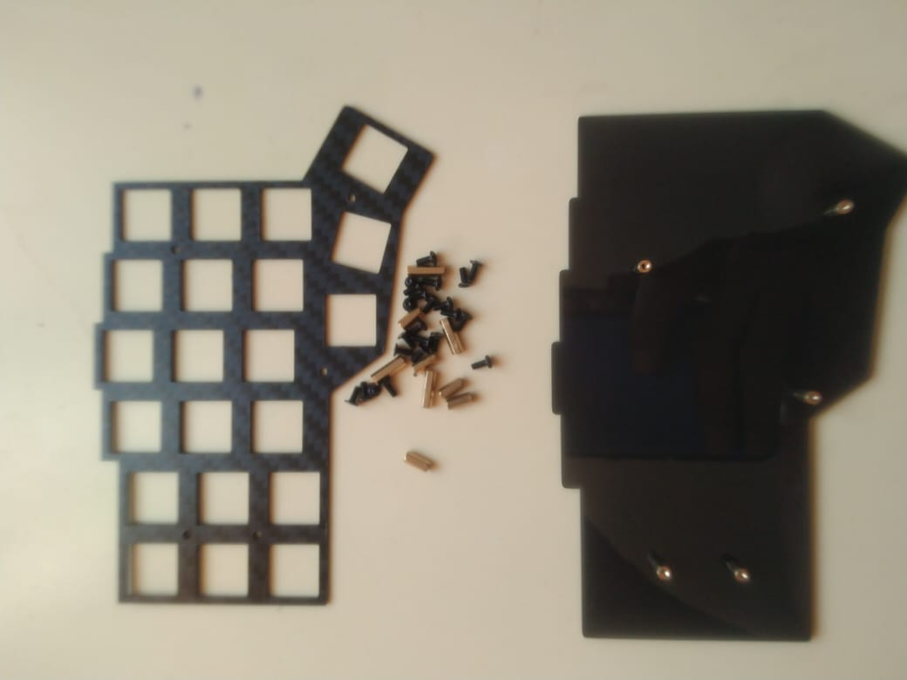
  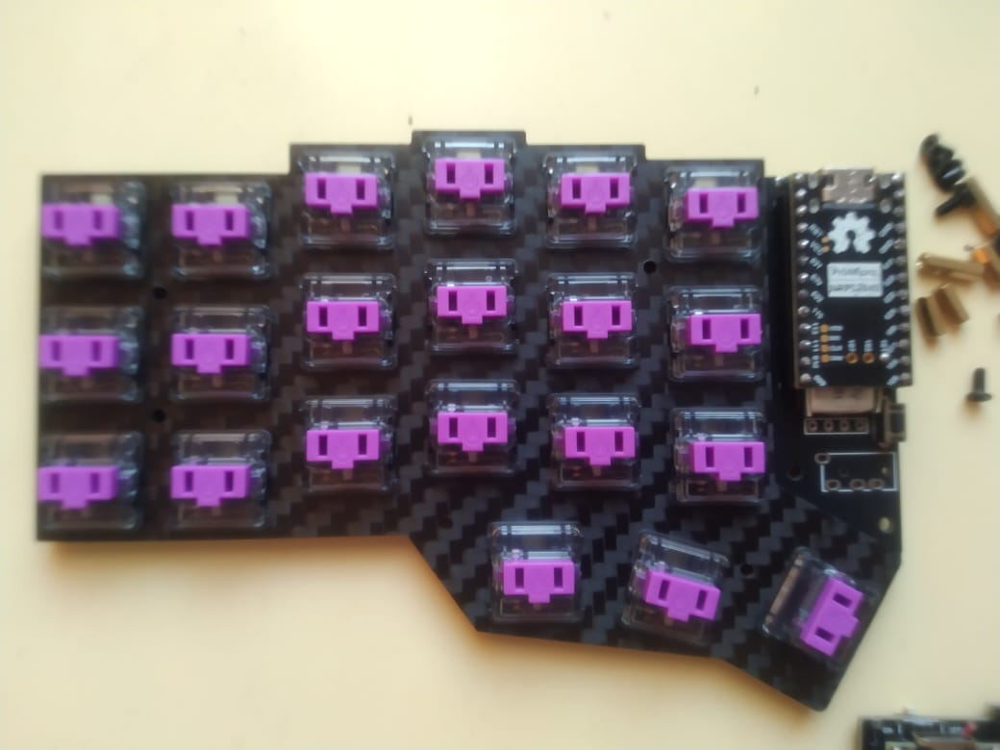

  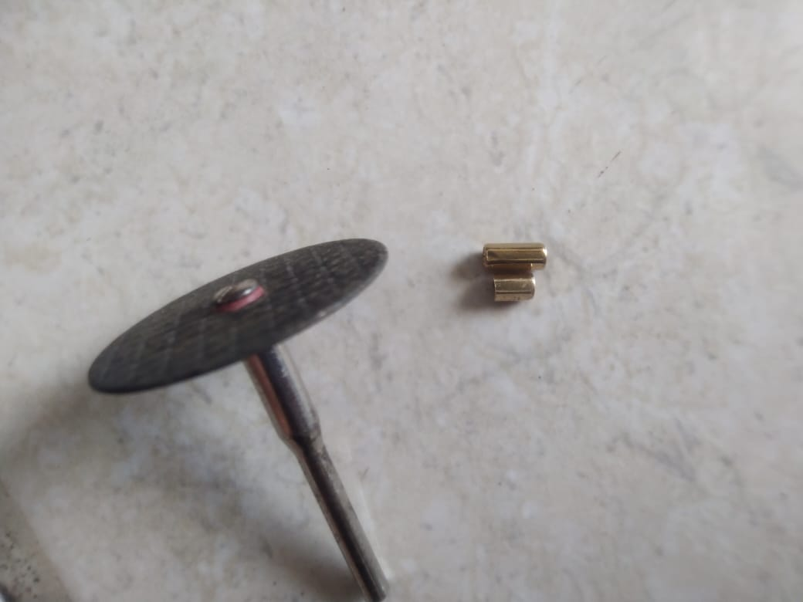
  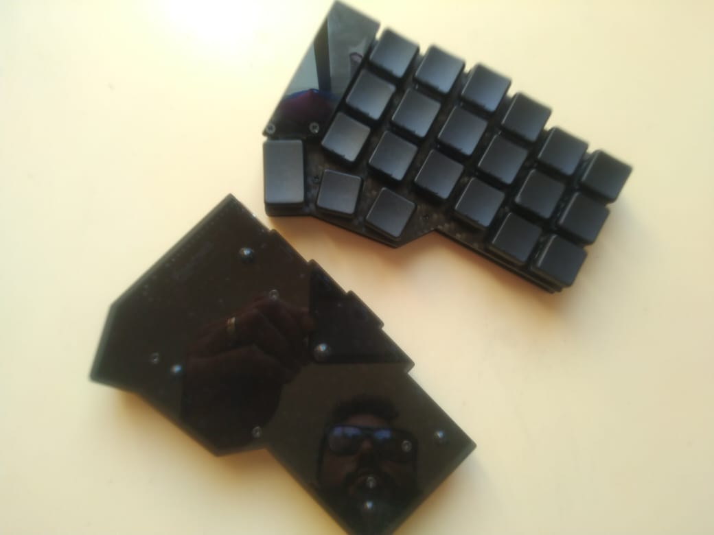

  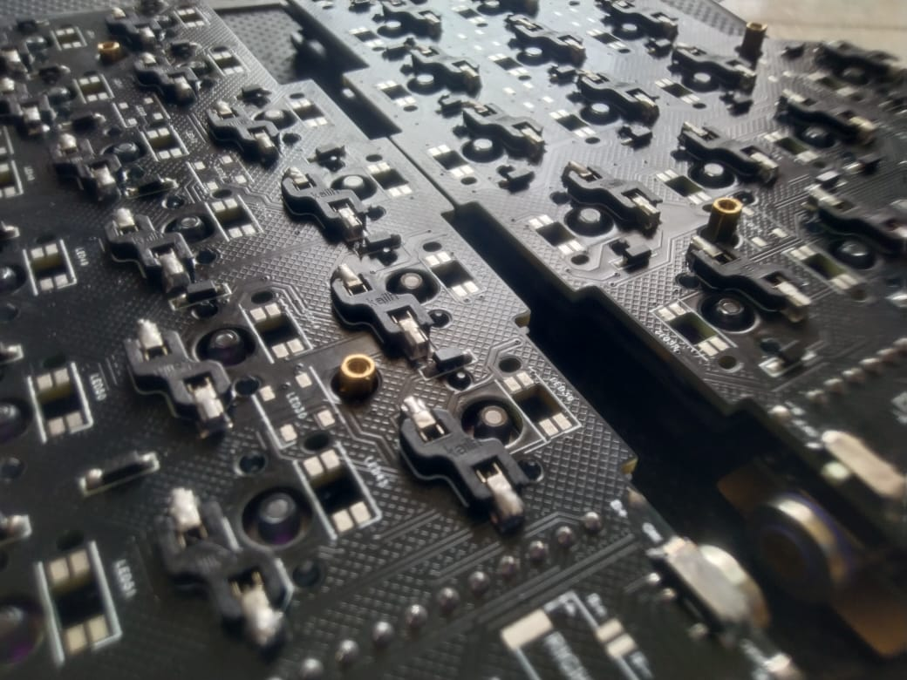
  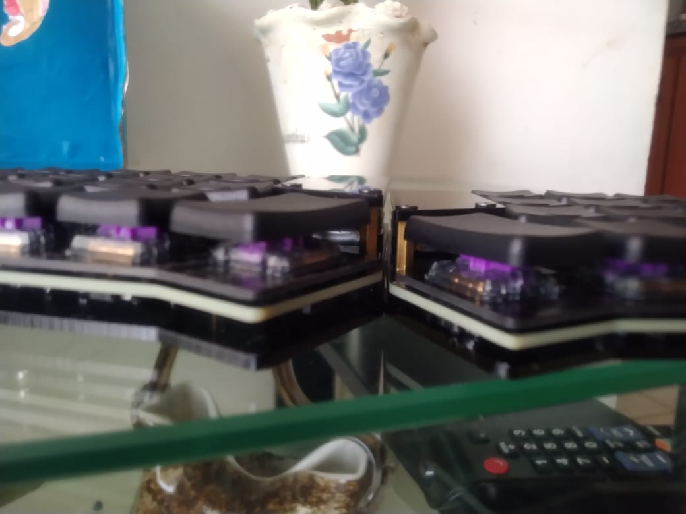

  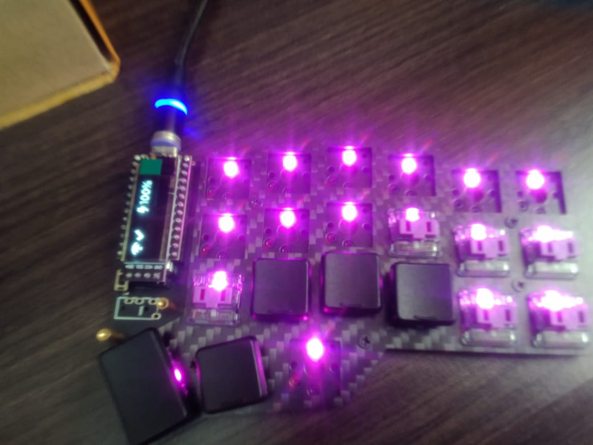
  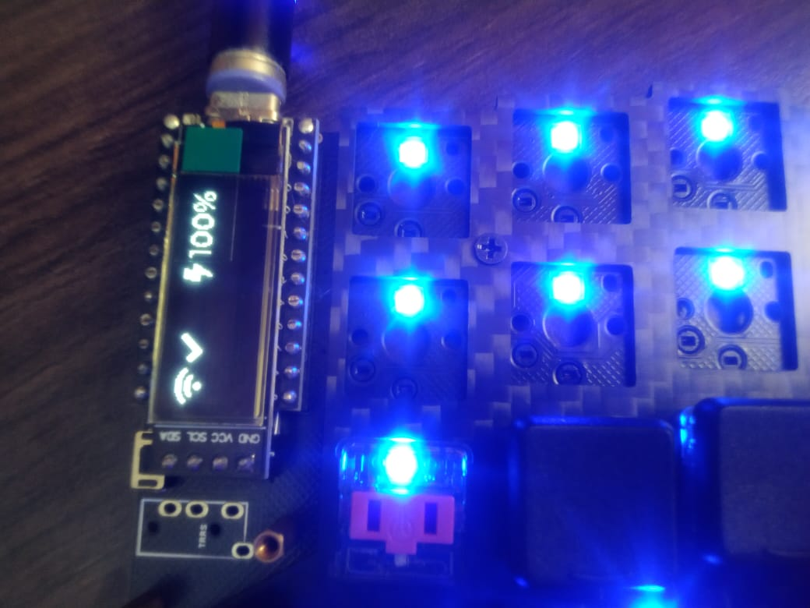

  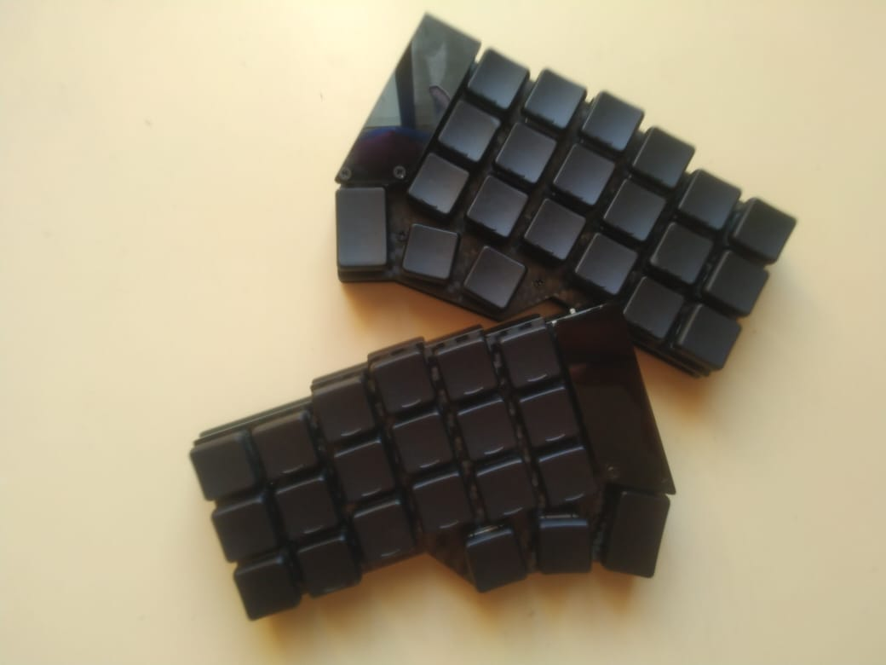
  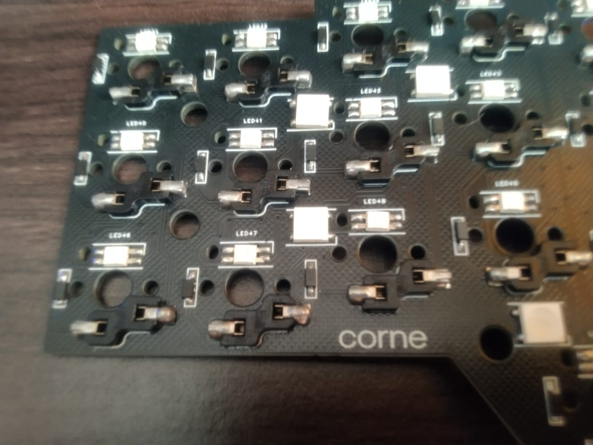

</div>

---

## 📚 Recursos

- 🔎 [Corne ZMK Visualizer Rey](https://github.com/hrking31/corne-keymap-visualizer-rey) — visualizador interactivo de este keymap
- 📘 [Documentación de ZMK](https://zmk.dev/docs)
- ⌨️ [Corne Keyboard (crkbd)](https://github.com/foostan/crkbd)
- 🪟 [Komorebi](https://github.com/LGUG2Z/komorebi) — gestor de ventanas en mosaico para Windows
- 💬 [Discord de ZMK](https://zmk.dev/community/discord)

---

## 👤 Autor

Proyecto creado por **Hernando Rey**
🔗 [GitHub](https://github.com/hrking31)

⭐ Si te resulta útil, deja una estrella en el repo.

---

*Si llegaste hasta aquí, probablemente también te duelen las muñecas. Vale la pena.*
